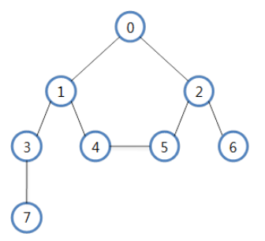

# 04. DFS(Depth-First Search)와 BFS(Breadth-First Search)

## 그래프(G) 탐색이란,

---

* 하나의 정점으로부터 시작하여 차례대로 모든 정점들을 한 번씩 방문하는 방법의 알고리즘 
* 탐색, 위치를 찾는 것

ex) 특정 도시에서 다른 도시로 갈 수 있는지 없는지, 전자 회로에서 특정 단자와 단자가 서로 연결되어 있는지

ex) 미로찾기, 출구찾기

---

    vertices(정점) : 요소가 들어있는 공간, 노드라고도 함. V(G)
    간선(edge) : 노드와 노드를 연결하는 선 E(G)

### 1) 무방향 그래프 (Undirected graph) 

* 정점을 연결하는 선에 방향이 없다. `(undirected, unordered)`
* 예를 들면, 쌍방통행이 가능한 도로의 지도
* (Vi, Vj) = (Vj, Vi)

### 2) 방향 그래프 (directed graph)

* 정점을 연결하는 선에 방향이 있음 `(directed, orderd)`
* 예를 들면, 일반통행만 있는 도로의 지도
* <Vi, Vj> != <Vj, Vi>

### 3) 그래프의 예

  

### 4) 그래프의 표현

    <2차열 배열로 표현>

        0 1 2 3 4 5 6 7
    0   0 1 1 0 0 0 0 0
    1   1 0 0 1 1 0 0 0
    2   1 0 0 0 0 1 1 0
    3   0 1 0 0 0 0 0 1
    4   0 1 0 0 0 1 0 0
    5   0 0 1 0 1 0 0 0
    6   0 0 1 0 0 0 0 0
    7   0 0 0 1 0 0 0 0

 

    <Linked list>
    0 -> 1 -> 2
    1 -> 0 -> 3 -> 4
    2 -> 0 -> 5 -> 6
    3 -> 1 -> 7
    4 -> 1 -> 5
    5 -> 2 -> 4
    6 -> 2
    7 -> 3

## ☝️ DFS(깊이 우선 탐색)

---
  * 예시 그래프

* 인접한 노드를 우선 탐색하는 방식
* `스택`을 활용하여 구분할 수 있음
* DFS 탐색 순서 : `0 - 1 - 3 - 7 - 4 - 5 - 2 - 6` or `0 - 2 - 6 - 5 - 4 - 1 - 3 - 7`

깊이 우선 탐색이란
루트 노드(혹은 다른 임의의 노드)에서 시작해서 다음 분기(branch)로 넘어가기 전에 해당 분기를 완벽하게 탐색하는 방법
미로를 탐색할 때 한 방향으로 갈 수 있을 때까지 계속 가다가 더 이상 갈 수 없게 되면 다시 가장 가까운 갈림길로 돌아와서 이곳으로부터 다른 방향으로 다시 탐색을 진행하는 방법과 유사
즉, 넓게(wide) 탐색하기 전에 깊게 (deep) 탐색하는 것이다.
사용하는 경우 : 모든 노드를 방문하고자 하는 경우에 이 방법을 선택
깊이 우선 탐색(DFS)이 너비 우선 탐색(BFS)보다 좀 더 간단핟.
단순 검색 속도 자체는 너비 우선 탐색에 비해서 느리다.

깊이 우선 탐색(DFS)의 특징
자기 자신을 호출하는 순환 알고리즘의 형태를 가지고 있다.
전위 순회(Pre-Order Traversals)를 포함한 다른 형태의 트리 순회는 모두 DFS의 한 종류이다.
이 알고리즘을 구현할 때 가장 큰 차이점은, 그래프 탐색의 경우 어떤 노드를 방문했었는지 여부를 반드시 검사 해야 한다는 것이다.
이를 검사하지 않을 경우 무한루프에 빠질 위험이 있다.

## ✌ BFS(너비 우선 탐색)

---
  * 예시 그래프

* 한 노들에 모든 인접한 노드를 탐색하는 방식
* `큐`를 활용하여 구현할 수 있음
* BFS 탐색 순서 : `0 - 1 - 2 - 3 - 4 - 5 - 6 - 7`

너비 우선 탐색이란
루트 노드(혹은 다른 임의의 노드)에서 시작해서 인접한 노드를 먼저 탐색하는 방법
시작 정점으로부터 가까운 정점을 먼저 방문하고 멀리 떨어져 있는 정점을 나중에 방문하는 순회 방법입니다.
즉, 깊게(deep) 탐색하기 전에 넓게(wide) 탐색하는 것이다.
사용하는 경우 : 두 노드 사이의 최단 경로 혹은 임의의 경로를 찾고 싶을 때 이 방법을 선택한다.
ex) 지구상에 존재하는 모든 친구 관계를 그래프로 표현한 후 Ash와 Vanessa 사이에 존재하는 경로를 찾는 경우
깊이 우선 탐색의 경우 - 모든 친구 관계를 다 살펴봐야 할지도 모른다.
너비 우선 탐색의 경우 - Ash와 가까운 관계부터 탐색
너비 우선 탐색(BFS)이 깊이 우선 탐색(DFS)보다 좀 더 복잡하다.

        0 1 2 3 4 5 6 7     <linked List>
    0   0 1 1 0 0 0 0 0     0 -> 1 -> 2
    1   1 0 0 1 1 0 0 0     1 -> 0 -> 3 -> 4
    2   1 0 0 0 0 1 1 0     .
    3   0 1 0 0 0 0 0 1     .
    4   0 1 0 0 0 1 0 0
    5   0 0 1 0 1 0 0 0
    6   0 0 1 0 0 0 0 0
    7   0 0 0 1 0 0 0 0

undirect graph (방향성이 없는 그래프)
direct graph (방향성이 있는 그래프)