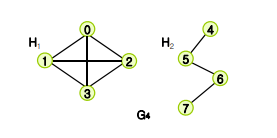

# 04. DFS(Depth-First Search)와 BFS(Breadth-First Search)

## 그래프(G) 탐색이란,

---

* 하나의 정점으로부터 시작하여 차례대로 모든 정점들을 한 번씩 방문하는 방법의 알고리즘 
* 탐색, 위치를 찾는 것

ex) 특정 도시에서 다른 도시로 갈 수 있는지 없는지, 전자 회로에서 특정 단자와 단자가 서로 연결되어 있는지

ex) 미로찾기, 출구찾기

---

    vertices(정점) : 요소가 들어있는 공간, 노드라고도 함. V(G)
    간선(edge) : 노드와 노드를 연결하는 선 E(G)

### 1) 무방향 그래프 (Undirected graph) 

* 정점을 연결하는 선에 방향이 없다. `(undirected, unordered)`
* 예를 들면, 쌍방통행이 가능한 도로의 지도
* (Vi, Vj) = (Vj, Vi)

### 2) 방향 그래프 (directed graph)

* 정점을 연결하는 선에 방향이 있음 `(directed, orderd)`
* 예를 들면, 일반통행만 있는 도로의 지도
* <Vi, Vj> != <Vj, Vi>

### 3) 그래프의 예

  

### 4) 그래프의 표현

    <2차열 배열로 표현>

        0 1 2 3 4 5 6 7
    0   0 1 1 0 0 0 0 0
    1   1 0 0 1 1 0 0 0
    2   1 0 0 0 0 1 1 0
    3   0 1 0 0 0 0 0 1
    4   0 1 0 0 0 1 0 0
    5   0 0 1 0 1 0 0 0
    6   0 0 1 0 0 0 0 0
    7   0 0 0 1 0 0 0 0

 

    <Linked list>
    0 -> 1 -> 2
    1 -> 0 -> 3 -> 4
    2 -> 0 -> 5 -> 6
    3 -> 1 -> 7
    4 -> 1 -> 5
    5 -> 2 -> 4
    6 -> 2
    7 -> 3

## ☝️ DFS(깊이 우선 탐색) * Depth-First-Search

---

### 깊이 우선 탐색이란

* 트리나 그래프에서 한 루트로 탐색하다가 특정 상황에서 최대한 깊숙히 들어가서 확인한 뒤 다시 돌아가 다른 루트로 탐색하는 방식
* 하나의 child 노드를 방문했으면, 이 후 해당 child의 이하 child로 검색하는 방식
* 모든 노드를 방문하고자 하는 경우에 이 방법을 선택
* `스택`을 활용하여 구현할 수 있음

### 깊이 우선 탐색(DFS)의 특징

1) 단순 검색 속도 자체는 BFS에 비해서 느림.
2) 검색이 아닌 순회(traversal)를 할 경우 많이 사용
3) 자기 자신을 호출하는 순환 알고리즘의 형태를 가지고 있다.
4) 어떤 노드를 방문했었는지 여부를 반드시 검사 지행

### 탐색 방법

   * 예시 그래프

1) 시작할 노드를 스택에 넣는다. (그래프는 트리와 다르게 반드시 0부터 시작할 필요없음)
2) 위 사진에서는 0으로 시작할 것으로 가정

1) 0을 스택에서 빼면서 출력을 한다.
2) 0과 인접한(연결된) 노드를 스택에 넣는다. (1,2)
3) 인접한 노드들을 넣을 때 순서는 상관없다. (1이 먼저 들어갈 수도 있고, 2가 먼저 들어갈 수도 있음)

1) 쌓는 순서는 상관없으나, 스택 특성상 위에 있는 것부터 출력을 해야한다.
2) 2가 위에 있어서 2를 뺀다.
3) 2와 인접한 노드들을 넣어준다. (0,2,6)
4) 인접한 노드 중 0은 이미 스택에 넣었으니 다시 넣지 않는다.

1) 스택에서 가장 위에 있는 6을 출력한다.
2) 6의 인접한 노드를 확인한다.(2)
3) 스택에 넣을 인접한 노드가 없기 때문에, 스택에 가장 위에 있는 노드를 출력해준다. (5)

`위 같은 방식이 계속 반복되므로 이하 생략`

결과 : `0 - 2 - 6 - 5 - 4 - 1 - 3 - 7` 순으로 탐색을 했다는 것을 알 수 있다.  
만약 인접한 노드가 스택에 쌓이는 순서가 바뀌었다면 탐색 방향은 달라질 수 있다.  
예를들어 2보다 1이 스택 위에 있었다면 순서는 `0 - 1 - 3 - 7 - 4 - 5 - 2 - 6` 이 된다.  

 

## ✌ BFS(너비 우선 탐색) * Breadth-First Search

---

### 너비 우선 탐색이란

* 하나의 child 노드를 방문하고, 이 후 이하 child로 이동하는 것이 아닌, 같은 위치에 있는 옆 child로 검색하는 방식
* level 단위로 검색
* `큐`를 활용하여 구현할 수 있음

### 탐색 방법

 * 예시 그래프

1) 시작할 노드를 Queue에 넣는다. (DFS와 동일하게 시작 노드는 어떤거든 상관없음)
2) Queue의 특징은 위 그림에서 보이는 것처럼 위(뒤)에서 노드가 들어오고 맨 아래(앞)에 위치한 노드부터 출력된다.

 * 0을 queue에서 빼고 0과 인접한 노드를 넣는다.(1,2)

 * 1을 빼서 출력해주고, 1과 인접한 노드들을 2 위(뒤)에 넣어준다.
 * 1과 인전 노드는 0, 3, 4 이지만 0은 이미 queue에 넣어졌었기 때문에 다시 넣지 않는다.

 * queue의 가장 아래(앞)에 해당하는 노드 2를 빼서 출력하고, 2와 인접한 노드를 넣어준다. 

`위 같은 방식이 계속 반복되므로 이해 생략`

결과 : 0 - 1 - 2 - 3 - 4 - 5 -6 -7 순으로 탐색이 된 것을 알 수 있다.

# 강시혁
